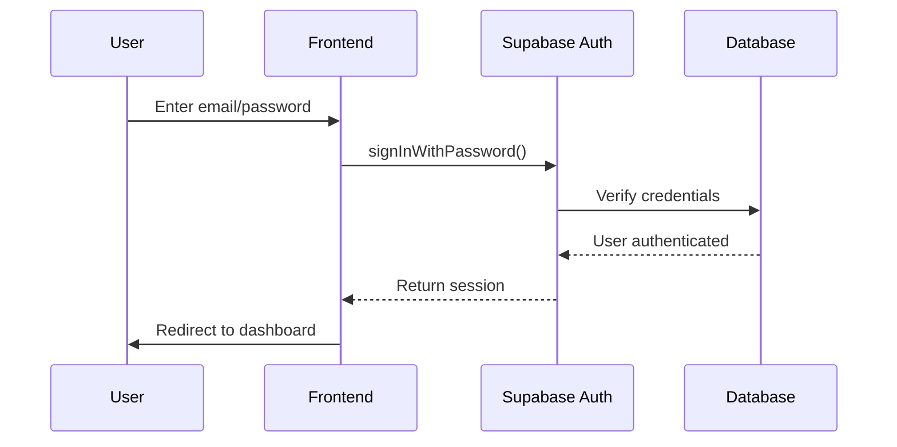
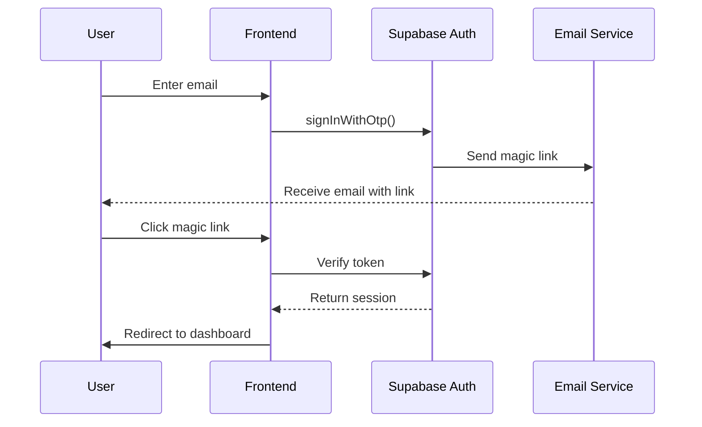
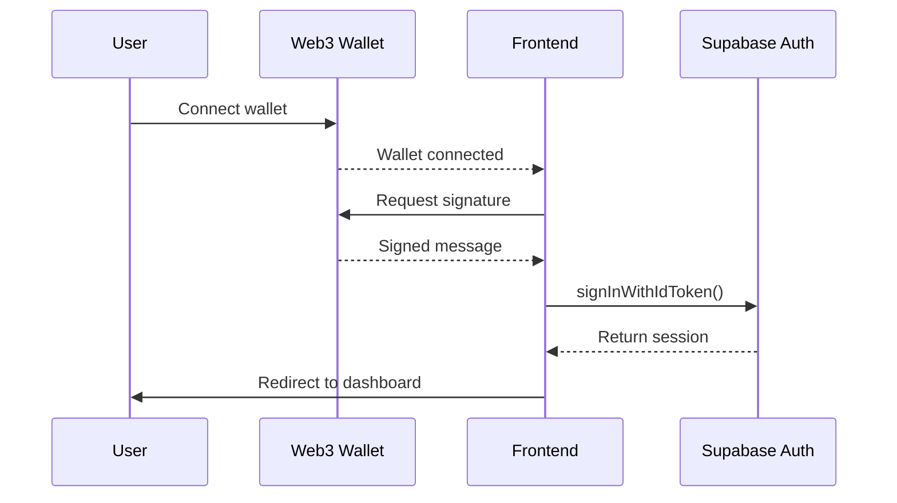

# 🗄️ Maya Travel Agent - Supabase Integration Guide

**Version:** 1.0.0
**Last Updated:** October 9, 2025
**Status:** Production Ready

---

## 📋 Table of Contents

1. [Supabase Architecture Overview](#-supabase-architecture-overview)
2. [Authentication System](#-authentication-system)
3. [Database Schema & Migrations](#-database-schema--migrations)
4. [Row Level Security (RLS)](#-row-level-security-rls)
5. [Edge Functions](#-edge-functions)
6. [Real-time Subscriptions](#-real-time-subscriptions)
7. [Storage Management](#-storage-management)
8. [Security Best Practices](#-security-best-practices)
9. [Performance Optimization](#-performance-optimization)
10. [Troubleshooting & Monitoring](#-troubleshooting--monitoring)

---

## 🏗️ Supabase Architecture Overview

### **Maya Travel Agent Supabase Architecture**

```
┌─────────────────────────────────────────────────────────────┐
│                    Supabase Project                         │
├─────────────────────────────────────────────────────────────┤
│  ┌─────────────┐  ┌─────────────┐  ┌─────────────────────┐  │
│  │   Auth      │  │  Database   │  │   Edge Functions    │  │
│  │ Management  │  │ PostgreSQL  │  │ (Serverless APIs)   │  │
│  └─────────────┘  └─────────────┘  └─────────────────────┘  │
├─────────────────────────────────────────────────────────────┤
│  ┌─────────────┐  ┌─────────────┐  ┌─────────────────────┐  │
│  │  Real-time  │  │   Storage   │  │   Row Level         │  │
│  │Subscriptions│  │   (Files)   │  │   Security (RLS)    │  │
│  └─────────────┘  └─────────────┘  └─────────────────────┘  │
└─────────────────────────────────────────────────────────────┘
                              │
                              ▼
┌─────────────────────────────────────────────────────────────┐
│                 Client Applications                         │
├─────────────────────────────────────────────────────────────┤
│  ┌─────────────┐  ┌─────────────┐  ┌─────────────────────┐  │
│  │   React     │  │  React      │  │   Mobile Apps       │  │
│  │  Frontend   │  │  Native     │  │  (iOS/Android)      │  │
│  └─────────────┘  └─────────────┘  └─────────────────────┘  │
└─────────────────────────────────────────────────────────────┘
```

### **Integration Points**

1. **Authentication:** User signup, login, session management
2. **Database:** Trip data, user profiles, expenses, destinations
3. **Real-time:** Live trip updates, collaborative features
4. **Edge Functions:** AI chat, payments, webhooks
5. **Storage:** Trip photos, documents, user avatars

---

## 🔐 Authentication System

### **Authentication Architecture**

```
┌─────────────────┐    ┌─────────────────┐    ┌─────────────────┐
│   Frontend      │    │   Supabase      │    │   Database      │
│   (React)       │◄──►│   Auth Service  │◄──►│   Profiles      │
│                 │    │                 │    │   Table         │
└─────────────────┘    └─────────────────┘    └─────────────────┘
       │                       │                       │
       ▼                       ▼                       ▼
┌─────────────────┐    ┌─────────────────┐    ┌─────────────────┐
│   Web3 Auth     │    │   Magic Link    │    │   OAuth         │
│   (MetaMask)    │    │   (Email)       │    │   (Google)      │
└─────────────────┘    └─────────────────┘    └─────────────────┘
```

### **Authentication Implementation**

#### **Frontend Authentication Service** (`lib/auth.ts`)
```typescript
import { supabase } from '@/integrations/supabase/client';
import type { User, AuthError } from '@supabase/supabase-js';

export class AuthService {
  // Email/Password Authentication
  static async signUp(email: string, password: string, metadata?: any) {
    try {
      const { data, error } = await supabase.auth.signUp({
        email,
        password,
        options: {
          data: metadata
        }
      });

      if (error) throw error;
      return { data, error: null };
    } catch (error) {
      return { data: null, error: error as AuthError };
    }
  }

  static async signIn(email: string, password: string) {
    try {
      const { data, error } = await supabase.auth.signInWithPassword({
        email,
        password
      });

      if (error) throw error;
      return { data, error: null };
    } catch (error) {
      return { data: null, error: error as AuthError };
    }
  }

  // Magic Link Authentication
  static async signInWithMagicLink(email: string) {
    try {
      const { data, error } = await supabase.auth.signInWithOtp({
        email,
        options: {
          emailRedirectTo: `${window.location.origin}/auth/callback`
        }
      });

      if (error) throw error;
      return { data, error: null };
    } catch (error) {
      return { data: null, error: error as AuthError };
    }
  }

  // Web3 Authentication
  static async signInWithWeb3(provider: any) {
    try {
      // Implementation for MetaMask, WalletConnect, etc.
      const { data, error } = await supabase.auth.signInWithIdToken({
        provider: 'custom',
        token: provider.token,
        access_token: provider.accessToken
      });

      if (error) throw error;
      return { data, error: null };
    } catch (error) {
      return { data: null, error: error as AuthError };
    }
  }

  // Session Management
  static async getCurrentUser(): Promise<User | null> {
    try {
      const { data: { user } } = await supabase.auth.getUser();
      return user;
    } catch (error) {
      console.error('Error getting current user:', error);
      return null;
    }
  }

  static async signOut() {
    try {
      const { error } = await supabase.auth.signOut();
      if (error) throw error;
      return { error: null };
    } catch (error) {
      return { error: error as AuthError };
    }
  }

  // Session Listener
  static onAuthStateChange(callback: (event: string, session: any) => void) {
    return supabase.auth.onAuthStateChange(callback);
  }
}
```

#### **React Auth Provider** (`components/Auth/AuthProvider.tsx`)
```typescript
import React, { createContext, useContext, useEffect, useState } from 'react';
import { User, Session } from '@supabase/supabase-js';
import { AuthService } from '@/lib/auth';
import { supabase } from '@/integrations/supabase/client';

interface AuthContextType {
  user: User | null;
  session: Session | null;
  loading: boolean;
  signUp: (email: string, password: string) => Promise<any>;
  signIn: (email: string, password: string) => Promise<any>;
  signOut: () => Promise<void>;
}

const AuthContext = createContext<AuthContextType | undefined>(undefined);

export const useAuth = () => {
  const context = useContext(AuthContext);
  if (context === undefined) {
    throw new Error('useAuth must be used within an AuthProvider');
  }
  return context;
};

export const AuthProvider: React.FC<{ children: React.ReactNode }> = ({ children }) => {
  const [user, setUser] = useState<User | null>(null);
  const [session, setSession] = useState<Session | null>(null);
  const [loading, setLoading] = useState(true);

  useEffect(() => {
    // Get initial session
    supabase.auth.getSession().then(({ data: { session } }) => {
      setSession(session);
      setUser(session?.user ?? null);
      setLoading(false);
    });

    // Listen for auth changes
    const {
      data: { subscription },
    } = supabase.auth.onAuthStateChange((_event, session) => {
      setSession(session);
      setUser(session?.user ?? null);
      setLoading(false);
    });

    return () => subscription.unsubscribe();
  }, []);

  const signUp = async (email: string, password: string) => {
    setLoading(true);
    try {
      return await AuthService.signUp(email, password);
    } finally {
      setLoading(false);
    }
  };

  const signIn = async (email: string, password: string) => {
    setLoading(true);
    try {
      return await AuthService.signIn(email, password);
    } finally {
      setLoading(false);
    }
  };

  const signOut = async () => {
    setLoading(true);
    try {
      await AuthService.signOut();
    } finally {
      setLoading(false);
    }
  };

  const value = {
    user,
    session,
    loading,
    signUp,
    signIn,
    signOut,
  };

  return <AuthContext.Provider value={value}>{children}</AuthContext.Provider>;
};
```

### **Authentication Flow Diagrams**

#### **Email/Password Flow**


#### **Magic Link Flow**


#### **Web3 Wallet Flow**


---

## 🗄️ Database Schema & Migrations

### **Core Database Schema**

#### **1. Profiles Table** (User Profiles)
```sql
-- Profiles table extending Supabase auth.users
CREATE TABLE profiles (
  id UUID REFERENCES auth.users(id) PRIMARY KEY,
  email TEXT UNIQUE NOT NULL,
  full_name TEXT,
  avatar_url TEXT,
  phone_number TEXT,
  date_of_birth DATE,
  nationality TEXT,
  preferred_language TEXT DEFAULT 'en',
  preferred_currency TEXT DEFAULT 'USD',
  web3_address TEXT,
  preferences JSONB DEFAULT '{}',
  created_at TIMESTAMP WITH TIME ZONE DEFAULT NOW(),
  updated_at TIMESTAMP WITH TIME ZONE DEFAULT NOW()
);

-- Indexes for performance
CREATE INDEX idx_profiles_email ON profiles(email);
CREATE INDEX idx_profiles_web3_address ON profiles(web3_address);
CREATE INDEX idx_profiles_preferences ON profiles USING GIN(preferences);

-- Trigger to update updated_at
CREATE OR REPLACE FUNCTION update_updated_at_column()
RETURNS TRIGGER AS $$
BEGIN
  NEW.updated_at = NOW();
  RETURN NEW;
END;
$$ LANGUAGE plpgsql;

CREATE TRIGGER update_profiles_updated_at
  BEFORE UPDATE ON profiles
  FOR EACH ROW
  EXECUTE FUNCTION update_updated_at_column();
```

#### **2. Trips Table** (Travel Itineraries)
```sql
-- Trips table for travel planning
CREATE TABLE trips (
  id UUID DEFAULT gen_random_uuid() PRIMARY KEY,
  user_id UUID REFERENCES profiles(id) ON DELETE CASCADE,
  title TEXT NOT NULL,
  description TEXT,
  start_date DATE,
  end_date DATE,
  budget DECIMAL(10,2),
  spent DECIMAL(10,2) DEFAULT 0,
  status TEXT DEFAULT 'planning' CHECK (status IN ('planning', 'active', 'completed', 'cancelled')),
  destinations JSONB DEFAULT '[]', -- Array of destination objects
  tags TEXT[] DEFAULT '{}', -- Trip tags for categorization
  is_public BOOLEAN DEFAULT false,
  cover_image_url TEXT,
  created_at TIMESTAMP WITH TIME ZONE DEFAULT NOW(),
  updated_at TIMESTAMP WITH TIME ZONE DEFAULT NOW()
);

-- Indexes for performance
CREATE INDEX idx_trips_user_id ON trips(user_id);
CREATE INDEX idx_trips_status ON trips(status);
CREATE INDEX idx_trips_start_date ON trips(start_date);
CREATE INDEX idx_trips_destinations ON trips USING GIN(destinations);
CREATE INDEX idx_trips_tags ON trips USING GIN(tags);

-- Trigger for updated_at
CREATE TRIGGER update_trips_updated_at
  BEFORE UPDATE ON trips
  FOR EACH ROW
  EXECUTE FUNCTION update_updated_at_column();
```

#### **3. Expenses Table** (Budget Tracking)
```sql
-- Expenses table for budget management
CREATE TABLE expenses (
  id UUID DEFAULT gen_random_uuid() PRIMARY KEY,
  trip_id UUID REFERENCES trips(id) ON DELETE CASCADE,
  user_id UUID REFERENCES profiles(id) ON DELETE CASCADE,
  category TEXT NOT NULL,
  subcategory TEXT,
  amount DECIMAL(10,2) NOT NULL,
  currency TEXT DEFAULT 'USD',
  description TEXT,
  date DATE DEFAULT CURRENT_DATE,
  location TEXT,
  receipt_url TEXT,
  tags TEXT[] DEFAULT '{}',
  is_recurring BOOLEAN DEFAULT false,
  created_at TIMESTAMP WITH TIME ZONE DEFAULT NOW(),
  updated_at TIMESTAMP WITH TIME ZONE DEFAULT NOW()
);

-- Indexes for performance
CREATE INDEX idx_expenses_trip_id ON expenses(trip_id);
CREATE INDEX idx_expenses_user_id ON expenses(user_id);
CREATE INDEX idx_expenses_category ON expenses(category);
CREATE INDEX idx_expenses_date ON expenses(date);
CREATE INDEX idx_expenses_amount ON expenses(amount);

-- Trigger for updated_at
CREATE TRIGGER update_expenses_updated_at
  BEFORE UPDATE ON expenses
  FOR EACH ROW
  EXECUTE FUNCTION update_updated_at_column();
```

#### **4. Destinations Table** (Global Destinations)
```sql
-- Destinations table for global travel destinations
CREATE TABLE destinations (
  id UUID DEFAULT gen_random_uuid() PRIMARY KEY,
  name TEXT NOT NULL,
  country TEXT NOT NULL,
  city TEXT,
  state TEXT,
  latitude DECIMAL(10,8),
  longitude DECIMAL(11,8),
  timezone TEXT,
  currency TEXT,
  language TEXT,
  description TEXT,
  highlights TEXT[],
  best_time_to_visit TEXT,
  average_cost_per_day DECIMAL(10,2),
  safety_rating INTEGER CHECK (safety_rating BETWEEN 1 AND 5),
  popularity_score INTEGER DEFAULT 0,
  image_url TEXT,
  is_active BOOLEAN DEFAULT true,
  created_at TIMESTAMP WITH TIME ZONE DEFAULT NOW(),
  updated_at TIMESTAMP WITH TIME ZONE DEFAULT NOW()
);

-- Indexes for performance
CREATE INDEX idx_destinations_country ON destinations(country);
CREATE INDEX idx_destinations_city ON destinations(city);
CREATE INDEX idx_destinations_coordinates ON destinations(latitude, longitude);
CREATE INDEX idx_destinations_popularity ON destinations(popularity_score DESC);

-- Trigger for updated_at
CREATE TRIGGER update_destinations_updated_at
  BEFORE UPDATE ON destinations
  FOR EACH ROW
  EXECUTE FUNCTION update_updated_at_column();
```

### **Migration Files Structure**

#### **Initial Migration** (`supabase/migrations/001_initial_schema.sql`)
```sql
-- Enable necessary extensions
CREATE EXTENSION IF NOT EXISTS "uuid-ossp";

-- Create profiles table
CREATE TABLE profiles (
  id UUID REFERENCES auth.users(id) PRIMARY KEY,
  email TEXT UNIQUE NOT NULL,
  full_name TEXT,
  avatar_url TEXT,
  preferences JSONB DEFAULT '{}',
  created_at TIMESTAMP WITH TIME ZONE DEFAULT NOW(),
  updated_at TIMESTAMP WITH TIME ZONE DEFAULT NOW()
);

-- Create trips table
CREATE TABLE trips (
  id UUID DEFAULT gen_random_uuid() PRIMARY KEY,
  user_id UUID REFERENCES profiles(id) ON DELETE CASCADE,
  title TEXT NOT NULL,
  description TEXT,
  budget DECIMAL(10,2),
  status TEXT DEFAULT 'planning',
  destinations JSONB DEFAULT '[]',
  created_at TIMESTAMP WITH TIME ZONE DEFAULT NOW(),
  updated_at TIMESTAMP WITH TIME ZONE DEFAULT NOW()
);

-- Create expenses table
CREATE TABLE expenses (
  id UUID DEFAULT gen_random_uuid() PRIMARY KEY,
  trip_id UUID REFERENCES trips(id) ON DELETE CASCADE,
  category TEXT NOT NULL,
  amount DECIMAL(10,2) NOT NULL,
  description TEXT,
  date DATE DEFAULT CURRENT_DATE,
  created_at TIMESTAMP WITH TIME ZONE DEFAULT NOW()
);

-- Create indexes
CREATE INDEX idx_profiles_email ON profiles(email);
CREATE INDEX idx_trips_user_id ON trips(user_id);
CREATE INDEX idx_trips_status ON trips(status);
CREATE INDEX idx_expenses_trip_id ON expenses(trip_id);
CREATE INDEX idx_expenses_category ON expenses(category);

-- Create updated_at triggers
CREATE TRIGGER update_profiles_updated_at BEFORE UPDATE ON profiles FOR EACH ROW EXECUTE FUNCTION update_updated_at_column();
CREATE TRIGGER update_trips_updated_at BEFORE UPDATE ON trips FOR EACH ROW EXECUTE FUNCTION update_updated_at_column();
CREATE TRIGGER update_expenses_updated_at BEFORE UPDATE ON expenses FOR EACH ROW EXECUTE FUNCTION update_updated_at_column();
```

#### **RLS Migration** (`supabase/migrations/002_enable_rls.sql`)
```sql
-- Enable Row Level Security
ALTER TABLE profiles ENABLE ROW LEVEL SECURITY;
ALTER TABLE trips ENABLE ROW LEVEL SECURITY;
ALTER TABLE expenses ENABLE ROW LEVEL SECURITY;

-- Create RLS policies for profiles
CREATE POLICY "Users can view own profile" ON profiles
  FOR SELECT USING (auth.uid() = id);

CREATE POLICY "Users can update own profile" ON profiles
  FOR UPDATE USING (auth.uid() = id);

CREATE POLICY "Users can insert own profile" ON profiles
  FOR INSERT WITH CHECK (auth.uid() = id);

-- Create RLS policies for trips
CREATE POLICY "Users can view own trips" ON trips
  FOR SELECT USING (auth.uid() = user_id);

CREATE POLICY "Users can create own trips" ON trips
  FOR INSERT WITH CHECK (auth.uid() = user_id);

CREATE POLICY "Users can update own trips" ON trips
  FOR UPDATE USING (auth.uid() = user_id);

CREATE POLICY "Users can delete own trips" ON trips
  FOR DELETE USING (auth.uid() = user_id);

-- Create RLS policies for expenses
CREATE POLICY "Users can view trip expenses" ON expenses
  FOR SELECT USING (
    trip_id IN (
      SELECT id FROM trips WHERE user_id = auth.uid()
    )
  );

CREATE POLICY "Users can create trip expenses" ON expenses
  FOR INSERT WITH CHECK (
    trip_id IN (
      SELECT id FROM trips WHERE user_id = auth.uid()
    )
  );

CREATE POLICY "Users can update trip expenses" ON expenses
  FOR UPDATE USING (
    trip_id IN (
      SELECT id FROM trips WHERE user_id = auth.uid()
    )
  );

CREATE POLICY "Users can delete trip expenses" ON expenses
  FOR DELETE USING (
    trip_id IN (
      SELECT id FROM trips WHERE user_id = auth.uid()
    )
  );
```

### **Migration Management**

#### **Creating New Migrations**
```bash
# Generate new migration file
npm run migrate:generate "add user preferences"

# This creates: supabase/migrations/20240101120000_add_user_preferences.sql
```

#### **Running Migrations**
```bash
# Run all pending migrations
npm run migrate

# List available migrations
npm run migrate:list

# Reset database and run all migrations (destructive)
npm run migrate:reset
```

---

## 🔒 Row Level Security (RLS)

### **RLS Policy Examples**

#### **Advanced Trip Policies**
```sql
-- Users can view public trips or their own trips
CREATE POLICY "Users can view public or own trips" ON trips
  FOR SELECT USING (
    is_public = true OR auth.uid() = user_id
  );

-- Users can view trips shared with them (future feature)
CREATE POLICY "Users can view shared trips" ON trips
  FOR SELECT USING (
    id IN (
      SELECT trip_id FROM trip_shares
      WHERE shared_with_user_id = auth.uid()
    )
  );
```

#### **Expense Category Policies**
```sql
-- Users can only create expenses for active trips
CREATE POLICY "Users can create expenses for active trips" ON expenses
  FOR INSERT WITH CHECK (
    trip_id IN (
      SELECT id FROM trips
      WHERE user_id = auth.uid()
      AND status IN ('planning', 'active')
    )
  );
```

#### **Profile Privacy Policies**
```sql
-- Users can view profiles of trip participants
CREATE POLICY "Users can view trip participant profiles" ON profiles
  FOR SELECT USING (
    id IN (
      SELECT DISTINCT user_id FROM trips
      WHERE id IN (
        SELECT trip_id FROM trip_participants
        WHERE user_id = auth.uid()
      )
    )
  );
```

### **RLS Performance Optimization**

#### **Optimized Policies with Indexes**
```sql
-- Create composite indexes for RLS queries
CREATE INDEX idx_trips_user_status ON trips(user_id, status);
CREATE INDEX idx_expenses_trip_user ON expenses(trip_id, user_id);

-- Use these indexes in policies for better performance
CREATE POLICY "Optimized trip access" ON trips
  FOR SELECT USING (
    auth.uid() = user_id OR
    (is_public = true AND status = 'active')
  );
```

#### **RLS Policy Testing**
```sql
-- Test RLS policies as different users
SET LOCAL auth.uid TO 'user-id-1';
SELECT * FROM trips; -- Should only show user's trips

SET LOCAL auth.uid TO 'user-id-2';
SELECT * FROM trips; -- Should show different trips

-- Test public trip access
SET LOCAL auth.uid TO NULL;
SELECT * FROM trips WHERE is_public = true; -- Should show public trips
```

---

## ⚡ Edge Functions

### **Edge Functions Overview**

Maya Travel Agent uses 9 Edge Functions for serverless API endpoints:

1. **`trip-ai-chat`** - AI-powered trip planning chat
2. **`create-checkout`** - Stripe checkout session creation
3. **`create-subscription`** - Subscription management
4. **`stripe-webhook`** - Stripe webhook handler
5. **`customer-portal`** - Customer portal access
6. **`telegram-webapp`** - Telegram Mini App authentication
7. **`telegram-webhook`** - Telegram bot webhook
8. **`whatsapp-webhook`** - WhatsApp integration
9. **`check-subscription`** - Subscription status checking

### **AI Chat Edge Function** (`supabase/functions/trip-ai-chat/index.ts`)
```typescript
import { serve } from "https://deno.land/std@0.168.0/http/server.ts";
import { createClient } from "https://esm.sh/@supabase/supabase-js@2";

const corsHeaders = {
  'Access-Control-Allow-Origin': '*',
  'Access-Control-Allow-Headers': 'authorization, x-client-info, apikey, content-type',
};

serve(async (req) => {
  // Handle CORS preflight requests
  if (req.method === 'OPTIONS') {
    return new Response('ok', { headers: corsHeaders });
  }

  try {
    // Get the authorization token
    const authHeader = req.headers.get('Authorization');
    if (!authHeader) {
      throw new Error('Authorization header missing');
    }

    // Create Supabase client
    const supabaseClient = createClient(
      Deno.env.get('SUPABASE_URL') ?? '',
      Deno.env.get('SUPABASE_ANON_KEY') ?? '',
      {
        global: {
          headers: { Authorization: authHeader },
        },
      }
    );

    // Get the current user
    const {
      data: { user },
      error: userError,
    } = await supabaseClient.auth.getUser();

    if (userError || !user) {
      throw new Error('Invalid token');
    }

    // Parse request body
    const { message, tripId, context } = await req.json();

    // Call AI service
    const aiResponse = await callAIService({
      message,
      userId: user.id,
      tripId,
      context,
    });

    // Log the interaction
    await supabaseClient.from('ai_interactions').insert({
      user_id: user.id,
      trip_id: tripId,
      message: message,
      response: aiResponse,
      created_at: new Date().toISOString(),
    });

    return new Response(
      JSON.stringify({
        response: aiResponse,
        user: user.id,
      }),
      {
        headers: { ...corsHeaders, 'Content-Type': 'application/json' },
        status: 200,
      }
    );
  } catch (error) {
    return new Response(
      JSON.stringify({ error: error.message }),
      {
        headers: { ...corsHeaders, 'Content-Type': 'application/json' },
        status: 400,
      }
    );
  }
});
```

### **Payment Edge Function** (`supabase/functions/create-checkout/index.ts`)
```typescript
import { serve } from "https://deno.land/std@0.168.0/http/server.ts";
import { createClient } from "https://esm.sh/@supabase/supabase-js@2";
import Stripe from "https://esm.sh/stripe@12.0.0?target=deno";

const corsHeaders = {
  'Access-Control-Allow-Origin': '*',
  'Access-Control-Allow-Headers': 'authorization, x-client-info, apikey, content-type',
};

serve(async (req) => {
  if (req.method === 'OPTIONS') {
    return new Response('ok', { headers: corsHeaders });
  }

  try {
    const supabaseClient = createClient(
      Deno.env.get('SUPABASE_URL') ?? '',
      Deno.env.get('SUPABASE_ANON_KEY') ?? ''
    );

    const {
      data: { user },
    } = await supabaseClient.auth.getUser();

    if (!user) {
      throw new Error('Authentication required');
    }

    const { priceId, tripId } = await req.json();

    // Initialize Stripe
    const stripe = new Stripe(Deno.env.get('STRIPE_SECRET_KEY') ?? '', {
      apiVersion: '2023-10-16',
    });

    // Create checkout session
    const session = await stripe.checkout.sessions.create({
      payment_method_types: ['card'],
      line_items: [
        {
          price: priceId,
          quantity: 1,
        },
      ],
      mode: 'payment',
      success_url: `${req.headers.get('origin')}/payment-success?trip_id=${tripId}`,
      cancel_url: `${req.headers.get('origin')}/payment-cancelled`,
      metadata: {
        userId: user.id,
        tripId: tripId,
      },
    });

    return new Response(
      JSON.stringify({
        sessionId: session.id,
        url: session.url,
      }),
      {
        headers: { ...corsHeaders, 'Content-Type': 'application/json' },
        status: 200,
      }
    );
  } catch (error) {
    return new Response(
      JSON.stringify({ error: error.message }),
      {
        headers: { ...corsHeaders, 'Content-Type': 'application/json' },
        status: 400,
      }
    );
  }
});
```

### **Deploying Edge Functions**
```bash
# Deploy all functions
supabase functions deploy

# Deploy specific function
supabase functions deploy trip-ai-chat

# Deploy with project reference
SUPABASE_PROJECT_ID=your-project-id supabase functions deploy

# Check function logs
supabase functions logs trip-ai-chat --limit 100
```

---

## 📡 Real-time Subscriptions

### **Real-time Architecture**

```typescript
// Real-time subscription service
export class RealtimeService {
  private subscriptions: Map<string, RealtimeChannel> = new Map();

  // Subscribe to trip updates
  subscribeToTrip(tripId: string, callback: (payload: any) => void) {
    const channel = supabase
      .channel(`trip-${tripId}`)
      .on('postgres_changes',
        {
          event: '*',
          schema: 'public',
          table: 'trips',
          filter: `id=eq.${tripId}`
        },
        callback
      )
      .subscribe();

    this.subscriptions.set(`trip-${tripId}`, channel);
    return channel;
  }

  // Subscribe to expense updates
  subscribeToExpenses(tripId: string, callback: (payload: any) => void) {
    const channel = supabase
      .channel(`expenses-${tripId}`)
      .on('postgres_changes',
        {
          event: '*',
          schema: 'public',
          table: 'expenses',
          filter: `trip_id=eq.${tripId}`
        },
        callback
      )
      .subscribe();

    this.subscriptions.set(`expenses-${tripId}`, channel);
    return channel;
  }

  // Unsubscribe from channel
  unsubscribe(channelName: string) {
    const channel = this.subscriptions.get(channelName);
    if (channel) {
      supabase.removeChannel(channel);
      this.subscriptions.delete(channelName);
    }
  }

  // Unsubscribe from all channels
  unsubscribeAll() {
    this.subscriptions.forEach((channel, name) => {
      supabase.removeChannel(channel);
    });
    this.subscriptions.clear();
  }
}
```

### **React Hook for Real-time Updates**
```typescript
// Custom hook for trip real-time updates
export const useRealtimeTrip = (tripId: string | null) => {
  const queryClient = useQueryClient();
  const [isConnected, setIsConnected] = useState(false);

  useEffect(() => {
    if (!tripId) return;

    const channel = supabase
      .channel(`trip-${tripId}`)
      .on('postgres_changes',
        {
          event: '*',
          schema: 'public',
          table: 'trips',
          filter: `id=eq.${tripId}`
        },
        (payload) => {
          console.log('Trip updated:', payload);

          // Invalidate and refetch trip data
          queryClient.invalidateQueries(['trip', tripId]);

          // Update specific trip in cache
          if (payload.eventType === 'UPDATE') {
            queryClient.setQueryData(['trip', tripId], payload.new);
          }
        }
      )
      .subscribe((status) => {
        setIsConnected(status === 'SUBSCRIBED');
      });

    return () => {
      supabase.removeChannel(channel);
    };
  }, [tripId, queryClient]);

  return { isConnected };
};
```

### **Real-time Features Implementation**

#### **Live Trip Updates**
```typescript
// TripCard component with real-time updates
export const TripCard: React.FC<{ tripId: string }> = ({ tripId }) => {
  const { data: trip } = useTrip(tripId);
  const { isConnected } = useRealtimeTrip(tripId);

  return (
    <Card>
      <CardHeader>
        <div className="flex items-center justify-between">
          <CardTitle>{trip?.title}</CardTitle>
          <div className="flex items-center gap-2">
            {isConnected ? (
              <Badge variant="outline" className="text-green-600">
                <div className="w-2 h-2 bg-green-600 rounded-full mr-1" />
                Live
              </Badge>
            ) : (
              <Badge variant="outline" className="text-gray-500">
                Offline
              </Badge>
            )}
          </div>
        </div>
      </CardHeader>
      <CardContent>
        <p>{trip?.description}</p>
        <div className="mt-4">
          <p className="text-sm text-gray-600">
            Budget: ${trip?.spent || 0} / ${trip?.budget || 0}
          </p>
        </div>
      </CardContent>
    </Card>
  );
};
```

#### **Collaborative Trip Planning**
```typescript
// Real-time collaboration hook
export const useTripCollaboration = (tripId: string) => {
  const [activeUsers, setActiveUsers] = useState<string[]>([]);
  const [userCursors, setUserCursors] = useState<Map<string, any>>(new Map());

  useEffect(() => {
    // Subscribe to presence channel
    const channel = supabase.channel(`trip-presence-${tripId}`, {
      config: {
        presence: {
          key: 'user-presence',
        },
      },
    });

    // Track user presence
    channel
      .on('presence', { event: 'sync' }, () => {
        const newState = channel.presenceState();
        const users = Object.keys(newState);
        setActiveUsers(users);
      })
      .on('presence', { event: 'join' }, ({ key, newPresences }) => {
        console.log('User joined:', key, newPresences);
      })
      .on('presence', { event: 'leave' }, ({ key, leftPresences }) => {
        console.log('User left:', key, leftPresences);
      })
      .subscribe(async (status) => {
        if (status === 'SUBSCRIBED') {
          // Track this user's presence
          await channel.track({
            user_id: 'current-user-id',
            online_at: new Date().toISOString(),
          });
        }
      });

    return () => {
      channel.unsubscribe();
    };
  }, [tripId]);

  return { activeUsers, userCursors };
};
```

---

## 📁 Storage Management

### **Storage Architecture**

```
supabase/storage/
├── 📁 trip-photos/        # Trip photos and images
├── 📁 receipts/          # Expense receipts
├── 📁 avatars/           # User profile pictures
├── 📁 documents/         # Trip documents
└── 📁 exports/           # Trip export files
```

### **Storage Configuration**

#### **Storage Buckets Setup**
```sql
-- Create storage buckets
INSERT INTO storage.buckets (id, name, public)
VALUES
  ('trip-photos', 'trip-photos', true),
  ('receipts', 'receipts', false),
  ('avatars', 'avatars', true),
  ('documents', 'documents', false),
  ('exports', 'exports', false);

-- Set up storage policies
CREATE POLICY "Users can upload trip photos" ON storage.objects
  FOR INSERT WITH CHECK (
    bucket_id = 'trip-photos' AND
    auth.role() = 'authenticated'
  );

CREATE POLICY "Users can view trip photos" ON storage.objects
  FOR SELECT USING (
    bucket_id = 'trip-photos'
  );

CREATE POLICY "Users can upload receipts" ON storage.objects
  FOR INSERT WITH CHECK (
    bucket_id = 'receipts' AND
    auth.role() = 'authenticated'
  );

CREATE POLICY "Users can view own receipts" ON storage.objects
  FOR SELECT USING (
    bucket_id = 'receipts' AND
    auth.uid()::text = (storage.foldername(name))[1]
  );
```

### **File Upload Service**
```typescript
// Storage service for file uploads
export class StorageService {
  static async uploadTripPhoto(file: File, tripId: string): Promise<string> {
    const fileExt = file.name.split('.').pop();
    const fileName = `${tripId}/${Date.now()}.${fileExt}`;

    const { data, error } = await supabase.storage
      .from('trip-photos')
      .upload(fileName, file);

    if (error) throw error;

    // Get public URL
    const { data: { publicUrl } } = supabase.storage
      .from('trip-photos')
      .getPublicUrl(fileName);

    return publicUrl;
  }

  static async uploadReceipt(file: File, expenseId: string): Promise<string> {
    const fileExt = file.name.split('.').pop();
    const fileName = `${expenseId}.${fileExt}`;

    const { data, error } = await supabase.storage
      .from('receipts')
      .upload(fileName, file);

    if (error) throw error;

    const { data: { publicUrl } } = supabase.storage
      .from('receipts')
      .getPublicUrl(fileName);

    return publicUrl;
  }

  static async deleteFile(bucket: string, fileName: string): Promise<void> {
    const { error } = await supabase.storage
      .from(bucket)
      .remove([fileName]);

    if (error) throw error;
  }

  static async listFiles(bucket: string, folder?: string): Promise<any[]> {
    const { data, error } = await supabase.storage
      .from(bucket)
      .list(folder);

    if (error) throw error;
    return data;
  }
}
```

### **Image Optimization**
```typescript
// Image upload with optimization
export const uploadOptimizedImage = async (
  file: File,
  tripId: string,
  maxWidth: number = 1920,
  quality: number = 0.8
): Promise<string> => {
  return new Promise((resolve, reject) => {
    const canvas = document.createElement('canvas');
    const ctx = canvas.getContext('2d')!;
    const img = new Image();

    img.onload = () => {
      // Calculate new dimensions
      const ratio = Math.min(maxWidth / img.width, maxWidth / img.height);
      canvas.width = img.width * ratio;
      canvas.height = img.height * ratio;

      // Draw and compress
      ctx.drawImage(img, 0, 0, canvas.width, canvas.height);

      canvas.toBlob(
        (blob) => {
          if (blob) {
            const optimizedFile = new File([blob], file.name, {
              type: 'image/jpeg',
              lastModified: Date.now(),
            });

            StorageService.uploadTripPhoto(optimizedFile, tripId)
              .then(resolve)
              .catch(reject);
          } else {
            reject(new Error('Failed to compress image'));
          }
        },
        'image/jpeg',
        quality
      );
    };

    img.onerror = () => reject(new Error('Failed to load image'));
    img.src = URL.createObjectURL(file);
  });
};
```

---

## 🔐 Security Best Practices

### **API Key Management**

#### **Environment Variables**
```bash
# Supabase configuration
VITE_SUPABASE_URL=https://your-project.supabase.co
VITE_SUPABASE_ANON_KEY=your-anon-key

# Service role key (server-side only)
SUPABASE_SERVICE_ROLE_KEY=your-service-role-key

# Edge function secrets
supabase secrets set OPENAI_API_KEY=your-key
supabase secrets set STRIPE_SECRET_KEY=your-key
```

#### **Row Level Security Policies**
```sql
-- Comprehensive RLS policies

-- Profiles table policies
CREATE POLICY "Users can view own profile" ON profiles
  FOR SELECT USING (auth.uid() = id);

CREATE POLICY "Users can update own profile" ON profiles
  FOR UPDATE USING (auth.uid() = id);

CREATE POLICY "Enable insert for authenticated users only" ON profiles
  FOR INSERT WITH CHECK (auth.role() = 'authenticated');

-- Trips table policies
CREATE POLICY "Users can view own trips" ON trips
  FOR SELECT USING (auth.uid() = user_id);

CREATE POLICY "Users can view public trips" ON trips
  FOR SELECT USING (is_public = true);

CREATE POLICY "Users can insert own trips" ON trips
  FOR INSERT WITH CHECK (auth.uid() = user_id);

CREATE POLICY "Users can update own trips" ON trips
  FOR UPDATE USING (auth.uid() = user_id);

CREATE POLICY "Users can delete own trips" ON trips
  FOR DELETE USING (auth.uid() = user_id);

-- Expenses table policies
CREATE POLICY "Users can view trip expenses" ON expenses
  FOR SELECT USING (
    auth.uid() = user_id OR
    trip_id IN (
      SELECT id FROM trips WHERE user_id = auth.uid()
    )
  );

CREATE POLICY "Users can manage trip expenses" ON expenses
  FOR ALL USING (
    trip_id IN (
      SELECT id FROM trips WHERE user_id = auth.uid()
    )
  );
```

### **Authentication Security**

#### **JWT Token Management**
```typescript
// Secure token handling
export class TokenManager {
  private static readonly TOKEN_KEY = 'supabase-auth-token';
  private static readonly REFRESH_THRESHOLD = 5 * 60 * 1000; // 5 minutes

  static async getValidToken(): Promise<string | null> {
    const tokenData = this.getStoredToken();

    if (!tokenData) return null;

    // Check if token needs refresh
    if (this.isTokenExpiringSoon(tokenData.expires_at)) {
      try {
        const { data } = await supabase.auth.refreshSession();
        if (data.session) {
          this.storeToken(data.session);
          return data.session.access_token;
        }
      } catch (error) {
        console.error('Token refresh failed:', error);
        this.clearToken();
        return null;
      }
    }

    return tokenData.access_token;
  }

  private static isTokenExpiringSoon(expiresAt: number): boolean {
    const expirationTime = expiresAt * 1000; // Convert to milliseconds
    const now = Date.now();
    return (expirationTime - now) < this.REFRESH_THRESHOLD;
  }

  private static getStoredToken() {
    try {
      const stored = localStorage.getItem(this.TOKEN_KEY);
      return stored ? JSON.parse(stored) : null;
    } catch {
      return null;
    }
  }

  private static storeToken(session: any) {
    localStorage.setItem(this.TOKEN_KEY, JSON.stringify({
      access_token: session.access_token,
      refresh_token: session.refresh_token,
      expires_at: session.expires_at,
    }));
  }

  private static clearToken() {
    localStorage.removeItem(this.TOKEN_KEY);
  }
}
```

#### **Rate Limiting**
```typescript
// Rate limiting for API endpoints
export const rateLimit = {
  // In-memory store for rate limiting
  attempts: new Map<string, { count: number; resetTime: number }>(),

  check: (identifier: string, maxAttempts: number = 100, windowMs: number = 15 * 60 * 1000) => {
    const now = Date.now();
    const userAttempts = rateLimit.attempts.get(identifier);

    if (!userAttempts || now > userAttempts.resetTime) {
      // Reset or initialize attempts
      rateLimit.attempts.set(identifier, {
        count: 1,
        resetTime: now + windowMs,
      });
      return true;
    }

    if (userAttempts.count >= maxAttempts) {
      return false; // Rate limit exceeded
    }

    userAttempts.count++;
    return true;
  },

  middleware: (maxAttempts: number = 100) => {
    return (req: Request, res: Response, next: Function) => {
      const identifier = req.ip || req.connection.remoteAddress;
      const allowed = rateLimit.check(identifier, maxAttempts);

      if (!allowed) {
        res.status(429).json({
          error: 'Too many requests',
          retryAfter: '15 minutes',
        });
        return;
      }

      next();
    };
  },
};
```

---

## 🚀 Performance Optimization

### **Database Performance**

#### **Query Optimization**
```sql
-- Create indexes for common queries
CREATE INDEX idx_trips_user_status_date ON trips(user_id, status, start_date DESC);
CREATE INDEX idx_expenses_trip_category_date ON expenses(trip_id, category, date DESC);

-- Use EXPLAIN ANALYZE to check query performance
EXPLAIN ANALYZE
SELECT t.*, COUNT(e.id) as expense_count
FROM trips t
LEFT JOIN expenses e ON t.id = e.trip_id
WHERE t.user_id = 'user-id'
GROUP BY t.id
ORDER BY t.created_at DESC;

-- Create materialized view for complex queries
CREATE MATERIALIZED VIEW trip_summary AS
SELECT
  t.id,
  t.title,
  t.budget,
  t.spent,
  COUNT(e.id) as expense_count,
  COUNT(CASE WHEN e.date >= CURRENT_DATE THEN 1 END) as upcoming_expenses
FROM trips t
LEFT JOIN expenses e ON t.id = e.trip_id
GROUP BY t.id, t.title, t.budget, t.spent;

-- Refresh materialized view periodically
REFRESH MATERIALIZED VIEW trip_summary;
```

#### **Connection Pooling**
```typescript
// Supabase client with optimized configuration
export const supabase = createClient(
  import.meta.env.VITE_SUPABASE_URL,
  import.meta.env.VITE_SUPABASE_ANON_KEY,
  {
    auth: {
      autoRefreshToken: true,
      persistSession: true,
      detectSessionInUrl: true,
    },
    global: {
      headers: {
        'X-Client-Info': 'maya-travel-agent',
      },
    },
    db: {
      schema: 'public',
    },
    realtime: {
      params: {
        eventsPerSecond: 10,
      },
    },
  }
);
```

### **Frontend Performance**

#### **React Query Optimization**
```typescript
// Optimized query configuration
export const queryClient = new QueryClient({
  defaultOptions: {
    queries: {
      staleTime: 5 * 60 * 1000, // 5 minutes
      cacheTime: 10 * 60 * 1000, // 10 minutes
      retry: (failureCount, error: any) => {
        // Don't retry on 4xx errors
        if (error?.status >= 400 && error?.status < 500) {
          return false;
        }
        return failureCount < 3;
      },
      refetchOnWindowFocus: false,
      refetchOnReconnect: true,
    },
    mutations: {
      retry: 1,
    },
  },
});

// Trip queries with optimistic updates
export const useTrip = (tripId: string) => {
  return useQuery({
    queryKey: ['trip', tripId],
    queryFn: () => fetchTrip(tripId),
    enabled: !!tripId,
  });
};

export const useUpdateTrip = () => {
  const queryClient = useQueryClient();

  return useMutation({
    mutationFn: updateTrip,
    onMutate: async (updatedTrip) => {
      // Cancel outgoing refetches
      await queryClient.cancelQueries(['trip', updatedTrip.id]);

      // Snapshot previous value
      const previousTrip = queryClient.getQueryData(['trip', updatedTrip.id]);

      // Optimistically update
      queryClient.setQueryData(['trip', updatedTrip.id], updatedTrip);

      return { previousTrip };
    },
    onError: (err, updatedTrip, context) => {
      // Rollback on error
      if (context?.previousTrip) {
        queryClient.setQueryData(['trip', updatedTrip.id], context.previousTrip);
      }
    },
    onSettled: (data, error, updatedTrip) => {
      // Always refetch after mutation
      queryClient.invalidateQueries(['trip', updatedTrip.id]);
    },
  });
};
```

#### **Code Splitting and Lazy Loading**
```typescript
// Lazy load page components
const TripPlanner = lazy(() => import('@/pages/TripPlanner'));
const Analytics = lazy(() => import('@/pages/Analytics'));
const Settings = lazy(() => import('@/pages/Settings'));

// Route-based code splitting
export const AppRoutes: React.FC = () => {
  return (
    <Suspense fallback={<LoadingSpinner />}>
      <Routes>
        <Route path="/" element={<Index />} />
        <Route path="/auth" element={<Auth />} />
        <Route path="/dashboard" element={<Dashboard />} />
        <Route
          path="/planner"
          element={
            <Suspense fallback={<LoadingSpinner />}>
              <TripPlanner />
            </Suspense>
          }
        />
        <Route
          path="/analytics"
          element={
            <Suspense fallback={<LoadingSpinner />}>
              <Analytics />
            </Suspense>
          }
        />
      </Routes>
    </Suspense>
  );
};
```

---

## 🔍 Troubleshooting & Monitoring

### **Common Issues & Solutions**

#### **1. Authentication Issues**

**Problem:** Users can't authenticate
```bash
# Check Supabase auth configuration
# 1. Verify environment variables
echo $VITE_SUPABASE_URL
echo $VITE_SUPABASE_ANON_KEY

# 2. Check Supabase dashboard auth settings
# 3. Verify redirect URLs are configured
# 4. Check RLS policies
```

**Problem:** Web3 authentication fails
```typescript
# Debug Web3 connection
try {
  if (window.ethereum) {
    const accounts = await window.ethereum.request({
      method: 'eth_requestAccounts'
    });
    console.log('Connected accounts:', accounts);
  }
} catch (error) {
  console.error('Web3 connection failed:', error);
}
```

#### **2. Database Issues**

**Problem:** RLS policies blocking queries
```sql
-- Debug RLS policies
SET LOCAL auth.uid TO 'your-user-id';
SELECT * FROM trips WHERE user_id = 'your-user-id';

-- Check policy permissions
SELECT * FROM pg_policies WHERE tablename = 'trips';
```

**Problem:** Slow queries
```sql
-- Analyze query performance
EXPLAIN ANALYZE SELECT * FROM trips WHERE user_id = 'user-id';

-- Check for missing indexes
SELECT schemaname, tablename, indexname
FROM pg_indexes
WHERE tablename = 'trips';
```

#### **3. Edge Functions Issues**

**Problem:** Functions not deploying
```bash
# Check function logs
supabase functions logs function-name

# Test function locally
supabase functions serve function-name

# Check environment variables
supabase secrets list
```

**Problem:** Functions timing out
```typescript
// Optimize function performance
export const corsHeaders = {
  'Access-Control-Allow-Origin': '*',
  'Access-Control-Allow-Headers': 'authorization, x-client-info, apikey, content-type',
};

serve(async (req) => {
  // Handle preflight requests quickly
  if (req.method === 'OPTIONS') {
    return new Response('ok', { headers: corsHeaders });
  }

  // Set timeout for long-running operations
  const timeoutPromise = new Promise((_, reject) =>
    setTimeout(() => reject(new Error('Function timeout')), 25000)
  );

  // Race between function and timeout
  return Promise.race([mainLogic(), timeoutPromise]);
});
```

### **Monitoring & Logging**

#### **Application Monitoring**
```typescript
// Error tracking service
export const logError = (error: Error, context?: any) => {
  console.error('Application Error:', error);

  // Send to monitoring service
  if (process.env.NODE_ENV === 'production') {
    // Example: Sentry, LogRocket, etc.
    // Sentry.captureException(error, { contexts: { custom: context } });
  }
};

// Performance monitoring
export const trackPerformance = (name: string, duration: number) => {
  if (process.env.NODE_ENV === 'production') {
    // Example: Google Analytics, custom metrics
    // gtag('event', 'timing_complete', {
    //   name,
    //   value: duration,
    // });
  }
};
```

#### **Database Monitoring**
```sql
-- Monitor active connections
SELECT
  datname as database,
  usename as username,
  client_addr as client_ip,
  state,
  now() - pg_stat_activity.query_start as duration
FROM pg_stat_activity
WHERE state = 'active'
ORDER BY duration DESC;

-- Monitor slow queries
SELECT
  query,
  calls,
  total_time,
  mean_time,
  rows
FROM pg_stat_statements
WHERE mean_time > 100  -- Queries slower than 100ms
ORDER BY mean_time DESC
LIMIT 10;

-- Monitor table sizes
SELECT
  schemaname,
  tablename,
  pg_size_pretty(pg_total_relation_size(schemaname||'.'||tablename)) as size
FROM pg_tables
WHERE schemaname = 'public'
ORDER BY pg_total_relation_size(schemaname||'.'||tablename) DESC;
```

### **Health Checks**

#### **API Health Check**
```typescript
// Health check endpoint
export const healthCheck = async (req: Request, res: Response) => {
  try {
    // Check database connection
    const { data, error } = await supabase
      .from('profiles')
      .select('id')
      .limit(1);

    if (error) throw error;

    // Check external services
    const aiServiceHealthy = await checkAIService();
    const stripeHealthy = await checkStripeService();

    res.json({
      status: 'healthy',
      timestamp: new Date().toISOString(),
      services: {
        database: 'healthy',
        ai_service: aiServiceHealthy ? 'healthy' : 'unhealthy',
        stripe: stripeHealthy ? 'healthy' : 'unhealthy',
      },
      uptime: process.uptime(),
      version: process.env.npm_package_version,
    });
  } catch (error) {
    res.status(503).json({
      status: 'unhealthy',
      timestamp: new Date().toISOString(),
      error: error.message,
    });
  }
};
```

#### **Frontend Health Monitoring**
```typescript
// React Error Boundary for crash reporting
export class ErrorBoundary extends React.Component<
  { children: React.ReactNode; fallback?: React.ComponentType },
  { hasError: boolean; error?: Error }
> {
  constructor(props: any) {
    super(props);
    this.state = { hasError: false };
  }

  static getDerivedStateFromError(error: Error) {
    // Log error to monitoring service
    logError(error, { component: 'ErrorBoundary' });
    return { hasError: true, error };
  }

  componentDidCatch(error: Error, errorInfo: any) {
    // Additional error logging
    logError(error, {
      component: 'ErrorBoundary',
      errorInfo,
      stack: error.stack,
    });
  }

  render() {
    if (this.state.hasError) {
      const FallbackComponent = this.props.fallback || DefaultErrorFallback;
      return <FallbackComponent />;
    }

    return this.props.children;
  }
}
```

---

## 📚 Additional Resources

### **Supabase Documentation**
- [Supabase Auth Guide](https://supabase.com/docs/guides/auth)
- [Database Guide](https://supabase.com/docs/guides/database)
- [Edge Functions Guide](https://supabase.com/docs/guides/functions)
- [Storage Guide](https://supabase.com/docs/guides/storage)
- [Realtime Guide](https://supabase.com/docs/guides/realtime)

### **Security Resources**
- [Row Level Security Guide](https://supabase.com/docs/guides/auth/row-level-security)
- [API Security Best Practices](https://supabase.com/docs/guides/api)
- [Environment Variables Guide](https://supabase.com/docs/guides/auth/managing-environments)

### **Performance Resources**
- [Database Performance](https://supabase.com/docs/guides/database/performance)
- [Query Optimization](https://supabase.com/docs/guides/database/query-optimization)
- [Connection Pooling](https://supabase.com/docs/guides/database/connecting-to-postgres)

---

**🎉 This comprehensive Supabase integration guide ensures Maya Travel Agent has a robust, secure, and scalable backend infrastructure. Follow these patterns and best practices for reliable data management and authentication.**

**Document Version:** 1.0.0
**Last Updated:** October 9, 2025
**Maintainer:** Development Team